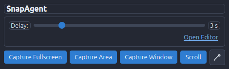
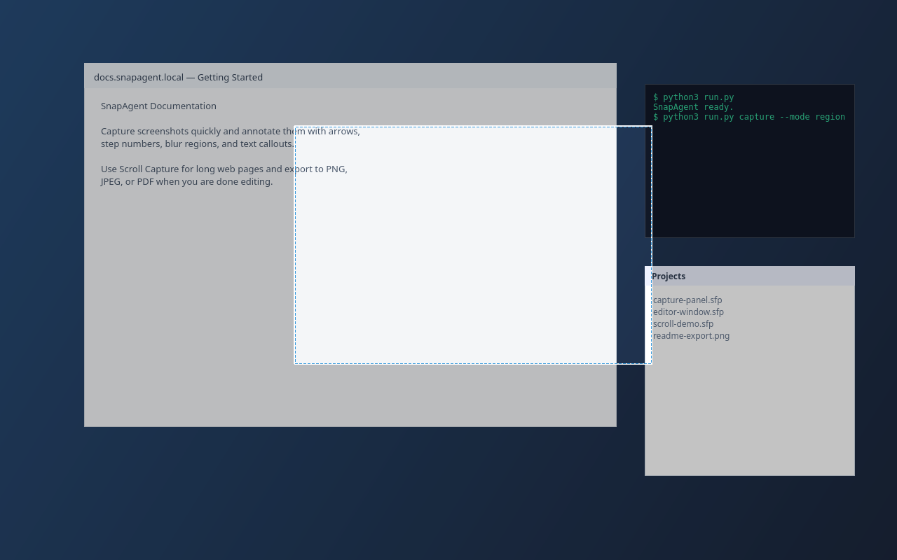
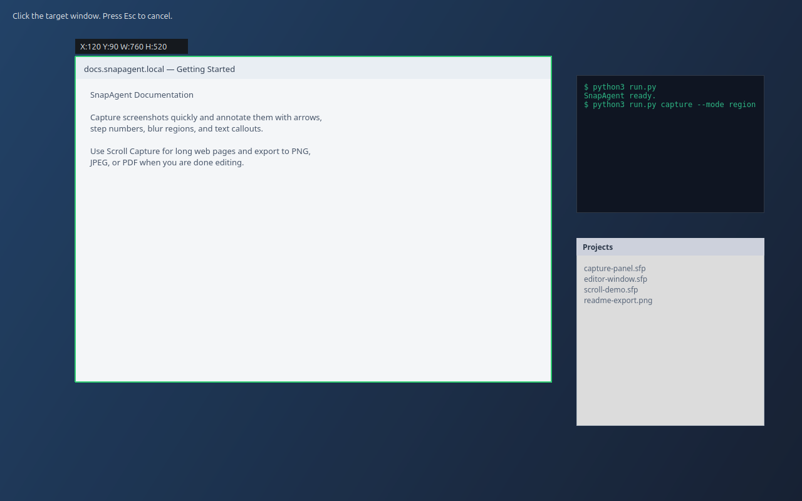
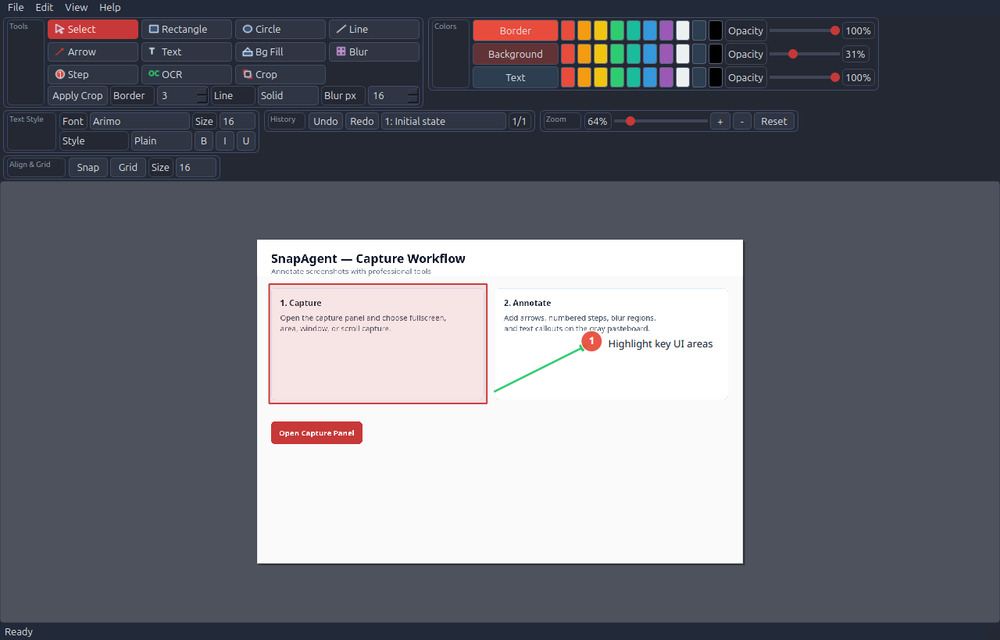
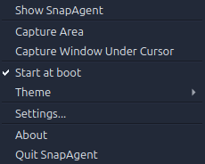
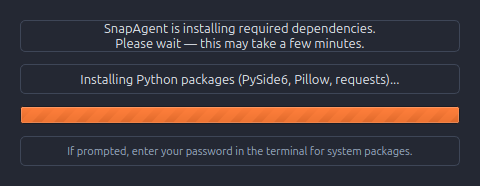

# Snappix

Snappix is a Linux screenshot and annotation application inspired by SnagIt.  
It combines fast capture workflows with a tabbed editor, non-destructive annotations, and project-based editing.

## Documentation

- **[Technical Documentation](docs/TECHNICAL.md)** — architecture, modules, config schema, capture pipeline, annotation model, platform notes

## Key Features

### Capture

- Compact **Capture Panel** with delay slider (0–20 s).
- Capture modes: **Fullscreen**, **Area**, **Window**, **Scroll**, and **Color Picker**.
- **Scroll capture** for long pages: select a window, Snappix scrolls it automatically and stitches the result.
- **Post-capture actions:** open in editor, copy to clipboard, or save to folder.
- **Global hotkeys** (configurable): default `Ctrl+Shift+A/W/F` for area/window/fullscreen.
- **Wayland support:** region capture via `grim`+`slurp` when available.
- Live **Window Overlay** preview (X11) and drag **Region Overlay**.
- **Color Picker Overlay** with cross-guides and clipboard copy.

### Editor

- Unified **Editor Host** with tabs for multiple screenshots.
- Annotation tools:
  - `Select`, `Rectangle`, `Circle`, `Line`, `Arrow`, `Text`
  - `Bg Fill`, `Blur` (redaction), `Step` (numbered callouts), `OCR`, `Crop`
- **Text styles:** plain, text box, speech bubble.
- **Line styles:** solid, dash, dot, dash-dot (lines and arrows).
- One-shot drawing + **lock mode** (double-click tool to lock).
- Editable elements with interactive resize handles.
- **Layer order:** bring forward/backward, bring to front/send to back.
- **Duplicate selection** (`Ctrl+D`).
- Full color workflow:
  - Border / Background / Text color
  - Per-target opacity sliders
  - Color palette quick buttons
- Text features: font family/size, bold/italic/underline, multi-line dialog.
- History: toolbar Undo/Redo + labeled history list with jump-to-state.
- Zoom: slider, +/-, Reset, Ctrl + mouse wheel.
- Alignment: optional grid, snap-to-grid, magnetic guides.
- Non-destructive crop (annotations remain editable).
- Clipboard: paste text, image, image URL; copy composited image.

### Themes & Settings

- **Light** and **Dark** themes (View → Theme or tray menu).
- Theme persisted in user config and restored on startup.
- **Settings dialog** (View → Settings or tray): hotkeys, post-capture action, save folder.

### Linux Integration

- Single-instance enforcement.
- System tray with capture shortcuts, theme, settings, autostart.
- Autostart toggle (XDG `.desktop` entry).
- First-run dependency installer (Tkinter progress UI).
- Desktop shortcut prompt on first run.
- Startup recovery: auto-save every 30 s, restore prompt on launch.

### Projects & Export

- Project format `*.sfp` (save/load editable projects).
- Export PNG / JPEG / PDF with quality and DPI prompts.
- Print support.

## Screenshots

The images below reflect the current Snappix UI, including the gray editor pasteboard around the drawable document.

### Capture Panel



### Region Overlay



### Window Overlay



### Editor Window



### System Tray Menu



### First-Time Setup



Regenerate screenshots after UI changes:

```bash
.venv/bin/python scripts/generate_readme_screenshots.py
```

## Requirements

### Required

- Python `3.11+`
- Linux desktop session
- Python packages (installed automatically into `.venv`):
  - PySide6, Pillow, requests, pynput

### X11 capture (window capture)

- `xdotool`
- `xwininfo`

### Optional (recommended)

```bash
# Wayland region capture
sudo apt install grim slurp

# OCR text extraction in editor
sudo apt install tesseract-ocr
```

## Install and Run

```bash
git clone https://github.com/joruf/snappix.git
cd snappix
python3 run.py
```

On first start, Snappix creates a local `.venv`, installs dependencies, and relaunches automatically.

## Usage Notes

### Capture Panel

| Control | Action |
|---------|--------|
| Capture Fullscreen | Captures complete virtual desktop |
| Capture Area | Opens drag-selection overlay |
| Capture Window | X11 window selection (Wayland: use Area/Scroll) |
| Scroll | Multi-frame scroll capture |
| Color picker | Eyedropper → clipboard |
| Open Editor | Opens editor or blank canvas tab |

### Scroll Capture

1. Click **Scroll** and click the target window (same picker as **Capture Window**).
2. Snappix detects the scrollbar, jumps to the top, scrolls to the bottom, and merges the frames.
3. The stitched screenshot opens in the editor automatically.
2. Scroll the target content.
3. Press **Space** to capture another frame (repeat as needed).
4. Press **Enter** to stitch frames, or **Esc** to cancel.

### Editor Tools

| Tool | Description |
|------|-------------|
| Blur | Pixelate area for redaction (adjust **Blur px** in toolbar) |
| Step | Place numbered tutorial badges |
| OCR | Select region; recognized text copied to clipboard |
| Text + Style | Choose Plain / Text box / Speech bubble under Text Style |

### Settings

Open via **View → Settings** (editor) or tray **Settings**:

- Enable/configure global hotkeys
- Choose action after capture (editor / clipboard / save)
- Set capture save folder (default: `~/Pictures/Snappix/`)

## CLI

```bash
# Capture full desktop as PNG
python3 run.py capture --mode full_screen --delay 1 --output /tmp/shot

# Interactive region or window capture
python3 run.py capture --mode region --output /tmp/area.png
python3 run.py capture --mode window --output /tmp/window.png

# Interactive color picker (prints HEX, optional clipboard copy)
python3 run.py pick-color --clipboard

# Export project without opening the editor
python3 run.py export --project ./example.sfp --format jpg --jpg-quality 90 --output ./export.jpg
python3 run.py export --project ./example.sfp --format pdf --pdf-dpi 300 --output ./export.pdf

# Open one project directly in GUI editor host
python3 run.py open --project ./example.sfp
```

## Keyboard Shortcuts

### Editor

| Shortcut | Action |
|----------|--------|
| `Ctrl+S` | Save project |
| `Ctrl+Shift+E` | Export dialog |
| `Ctrl+P` | Print |
| `Ctrl+Shift+S` | Save project as |
| `Ctrl+O` | Open project |
| `Ctrl+Z` | Undo |
| `Ctrl+Y` / `Ctrl+Shift+Z` | Redo |
| `Ctrl+D` | Duplicate selection |
| `Ctrl+C` | Copy composited image |
| `Ctrl+V` | Paste text/image file/image URL |
| `Ctrl + Mouse Wheel` | Zoom |
| `Ctrl++` / `Ctrl+-` | Resize selection ±10% |
| `Enter` | Apply crop |
| `Esc` | Cancel crop/overlay |

### Global (default, configurable)

| Shortcut | Action |
|----------|--------|
| `Ctrl+Shift+A` | Capture area |
| `Ctrl+Shift+W` | Capture window |
| `Ctrl+Shift+F` | Capture fullscreen |

### Scroll Capture Overlay

| Key | Action |
|-----|--------|
| `Space` | Add frame |
| `Enter` | Finish and stitch |
| `Esc` | Cancel |

## Project Format

Snappix saves projects as ZIP-based `*.sfp` files:

- `manifest.json` with metadata and annotations
- `assets/screenshot.png` as base image
- optional `assets/image-*.png` for embedded pasted images

Annotation payload extensions include `stroke_style`, `text_style`, `z_index`, and `step_number`.  
See [Technical Documentation](docs/TECHNICAL.md#annotation-model) for details.

## Configuration

User settings: `~/.config/snappix/config.json`

Includes theme, autostart, hotkeys, post-capture action, and save directory.  
Full schema: [Technical Documentation → Configuration](docs/TECHNICAL.md#configuration).

## Testing

```bash
.venv/bin/python -m unittest discover -s tests -v
```

## Release and Deployment

```bash
# Debian package
./packaging/build_deb.sh

# AppImage package
./packaging/build_appimage.sh
```

Build artifacts are written to `dist/`.

## License

See repository license file for terms.
