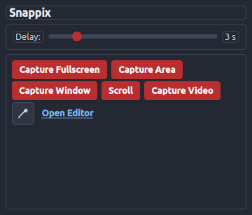
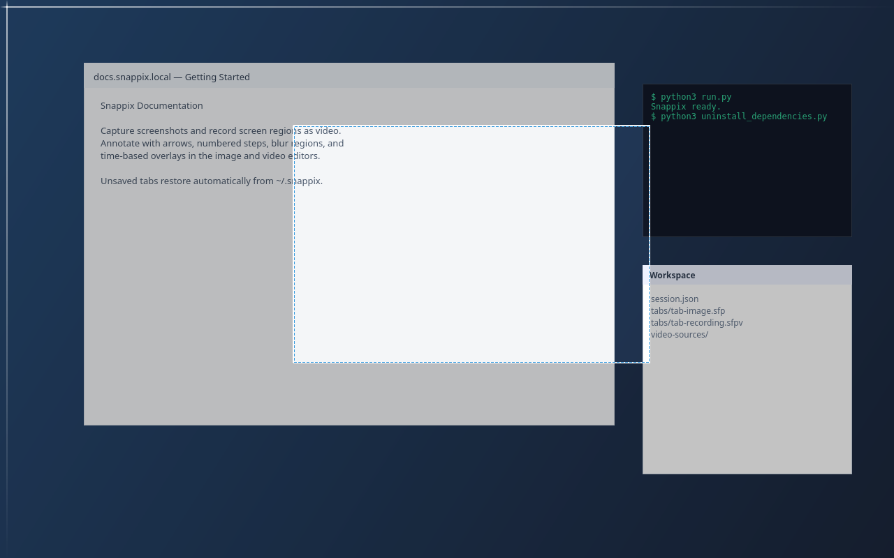
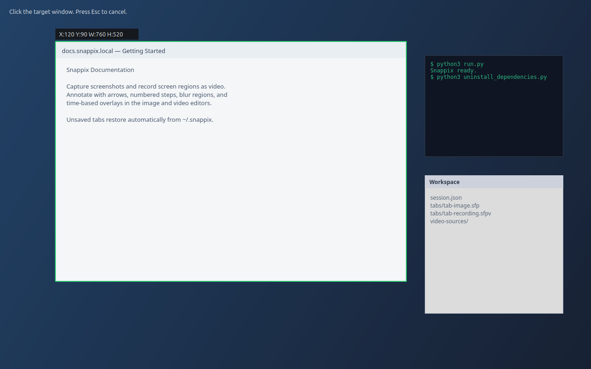
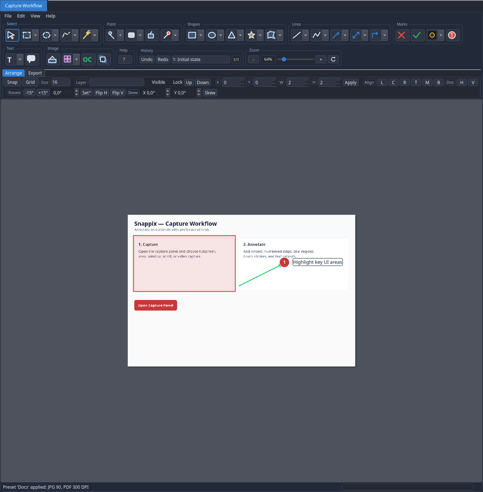
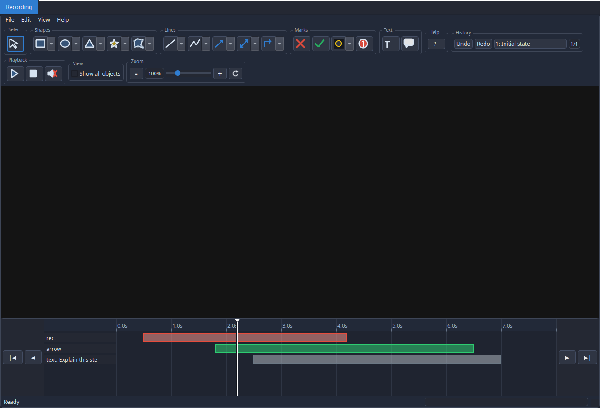
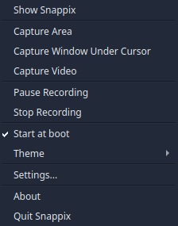
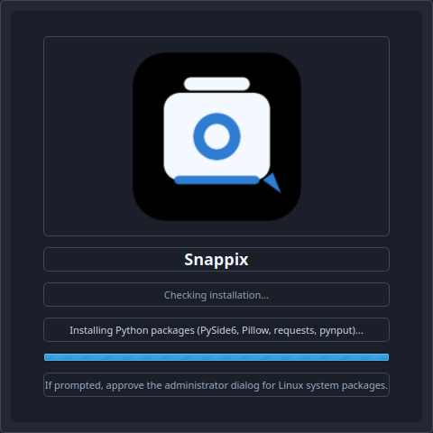

# Snappix

Snappix is a screenshot and annotation app for Linux and Windows.  
Capture quickly, annotate in a tabbed editor, record screen regions as video, and keep projects editable as `.sfp` / `.sfpv` files. Primary platform is **Linux**; **Windows 10/11** is supported as an MVP.

**[Technical Documentation](docs/TECHNICAL.md)** — architecture, modules, config schema, capture pipeline, session workspace, video editor

---

## Install and Run

You do **not** need a suitable system Python. The launchers download a project-local `uv` toolchain, install managed **Python 3.12**, create `.venv`, install pinned packages, set up OS tools where possible, and start Snappix.

```bash
git clone https://github.com/joruf/snappix.git
cd snappix
```

### Linux

```bash
chmod +x snappix.sh install.sh
./snappix.sh          # install (if needed) + start
# or install only:
./install.sh
```

On first run the installer may ask for administrator rights (`sudo` / `pkexec`) to install packages such as `libxcb-cursor0`, `xdotool`, `xwininfo`, `tesseract-ocr`, and recommended tools (`ffmpeg`, `grim`, `slurp`).

**Manual system packages** (if the first-run installer is blocked):

```bash
# Debian / Ubuntu / Linux Mint
sudo apt install libxcb-cursor0 python3-tk python3-venv xdotool x11-utils tesseract-ocr grim slurp ffmpeg
```

| Package | Why |
|---------|-----|
| `libxcb-cursor0` | Qt cursor support |
| `python3-tk` / `python3-venv` | First-run installer UI (when using system Python) |
| `xdotool`, `x11-utils` | Window / scroll capture on X11 |
| `tesseract-ocr` | OCR tool |
| `grim`, `slurp` | Recommended for Wayland region / fullscreen capture |
| `ffmpeg` | Video recording and MP4 export |

**Fallback** when Python 3.11+ is already installed:

```bash
python3 run.py
```

### Windows

```bat
Snappix.bat
```

Or double-click `Snappix.bat` in Explorer. Install-only (no GUI start): `install.bat`.

On first run Snappix:

1. Downloads project-local `uv` and managed Python 3.12 into `.snappix-runtime\`
2. Creates `.venv` and installs PySide6 / Pillow / requests / pynput
3. Tries to install **ffmpeg** and **tesseract** via `winget` when available

If `winget` is missing or blocked, install tools yourself (then restart the terminal / Snappix):

```bat
winget install --id Gyan.FFmpeg -e --source winget
winget install --id UB-Mannheim.TesseractOCR -e --source winget
```

**Fallback** when Python 3.11+ is already on PATH:

```bat
py -3.12 run.py
```

Avoid the Microsoft Store `python.exe` stub under `WindowsApps` (it prints an install hint and does nothing useful). Prefer `Snappix.bat`, `py -3.12`, or the python.org installer path.

**Windows capture modes:** Fullscreen, Area, Color Picker, **Capture Window**, and **Scroll** are available. **Capture Video** appears when `ffmpeg` is found (PATH or common winget install locations).

### Uninstall Snappix-owned dependencies

Snappix records which system packages and integration files **it** installed. To remove only those artifacts (plus `.venv` / `.snappix-runtime` when created by Snappix):

```bash
# Linux
python3 uninstall_dependencies.py
python3 uninstall_dependencies.py -y --remove-config

# Windows (from the project folder, using the venv if present)
.venv\Scripts\python.exe uninstall_dependencies.py
.venv\Scripts\python.exe uninstall_dependencies.py -y --remove-config
```

Pre-existing system packages are left untouched.

### Supported operating systems

| Environment | Screenshots | Video recording | Window / scroll capture |
|-------------|----------------|-----------------|-------------------------|
| **Linux + X11** (tools installed) | Yes | Yes (`ffmpeg` x11grab) | Yes (`xdotool`, `xwininfo`) |
| **Linux + Wayland** | Yes (prefer `grim`/`slurp`; else Qt overlay) | No (X11-only) | No (X11-only) |
| **Windows** (MVP) | Yes (Qt overlay) | Yes (`ffmpeg` gdigrab; button shown when ffmpeg is found) | Window + Scroll (Win32; scroll best-effort) |
| **macOS** | No | No | No |

#### Tested and verified

| Platform | What was verified |
|----------|-------------------|
| **[Linux Mint](https://linuxmint.com/) 22.3 + X11** | Primary development platform. Real probes: fullscreen screenshot CLI, 1 s video capture via `ffmpeg` x11grab, window/scroll tools present, OCR/ffmpeg/grim/slurp available, compatibility unit tests green. |
| **Linux Mint 22.3 + Wayland (tool check)** | `grim`/`slurp` present; video and window/scroll marked X11-only (as designed). |
| **Ubuntu 22.04 / 24.04 (CI)** | Automated `unittest` suite on GitHub Actions with Python 3.11 and 3.12 (headless / offscreen). |
| **Windows** | Code paths + unit tests for gdigrab, Win32 window/scroll pick, `%APPDATA%` config, Startup-folder autostart. |

Other Debian/Ubuntu-based desktops with the packages above should work similarly; detailed probe logs live under [`docs/vm-compat-reports`](docs/vm-compat-reports/COMPATIBILITY.md).

### Requirements

- No system Python required when using `Snappix.bat` / `./snappix.sh` (they provision managed Python **3.12**)
- Or any host Python that can start bootstrap; the app itself runs on **3.11+** inside `.venv`
- Linux desktop (X11 or Wayland), or **Windows 10/11** (MVP)
- Network access on first run (download `uv` / Python / pip packages)
- Python packages (installed into `.venv`): PySide6 (+ Addons/Essentials), Pillow, requests, pynput

### Packages / releases

Each build script needs the tool below installed on the machine you run it on (CI installs
these automatically for tagged releases, see `.github/workflows/release.yml`):

| Format | Build machine | Extra local tooling |
|--------|--------------|----------------------|
| `.deb` | Linux (Debian/Ubuntu-based) | none — uses `dpkg-deb`, already present |
| AppImage | Linux | [`appimagetool`](https://github.com/AppImage/AppImageKit/releases) on `PATH` |
| Flatpak | Linux | `flatpak-builder` (`sudo apt install flatpak-builder`); the script installs the `org.kde.Platform`/`org.kde.Sdk` 6.9 runtime itself on first run |
| Windows `.zip` | Windows | `pip install pyinstaller` |

```bash
# Debian package (Ubuntu / Linux Mint)
./packaging/build_deb.sh 0.1.0

# AppImage (portable, any modern Linux)
./packaging/build_appimage.sh 0.1.0

# Flatpak (Ubuntu / Linux Mint / most distros)
./packaging/build_flatpak.sh 0.1.0

# Windows executable (run on Windows)
python packaging/build_windows.py 0.1.0
```

Artifacts land in `dist/`: `.deb`, `.AppImage`, `Snappix-{version}-x86_64.flatpak`, and a
`Snappix-{version}-windows-x64.zip` (one-folder PyInstaller build — unzip and run `Snappix.exe`,
no Python required). Tag `v1.2.0` (or run **Release Build** in GitHub Actions) to build all four
and publish them as GitHub Release assets.

The Flatpak sandboxes the PySide6/Python runtime but, like the `.deb`, still expects `xdotool`,
`x11-utils`, and (on Wayland) `grim`/`slurp`/`ffmpeg`/`tesseract` to be installed on the host
(`--filesystem=host` in `packaging/flatpak/io.github.joruf.Snappix.yml`) — bundling those as
Flatpak modules too would be a much larger, slower build.

---

## Key Features

### Capture

- Compact **Capture Panel** with delay (0–20 s); startup width fits the primary capture buttons on one row, with Color Picker/OCR/Open Editor wrapping below
- Modes: **Fullscreen**, **Area**, **Color Picker**, **OCR** (select a region, recognized text is copied to clipboard — the screenshot itself is discarded), **Capture Window**, **Scroll**; **Capture Video** when tools are present
- On Windows: Scroll uses Win32 PageDown (best-effort); Capture Video appears when `ffmpeg` is available
- **Auto scroll capture** for long pages on Linux (scrollbar detect + stitch)
- Post-capture: open editor, copy clipboard, or save to folder
- Global hotkeys (defaults include `Ctrl+Shift+A/W/F/V/P/R`; unavailable modes are not registered)
- Wayland region capture via `grim` + `slurp` when available
- **Autostart mode**: launching via the OS boot/login entry (`--autostart`) keeps Snappix tray-only — no Capture window, no restored Editor tabs; a normal manual start is unaffected

### Video (X11)

- **Capture Video**: select a region, record with `ffmpeg` (requires `ffmpeg`)
- Pause / Resume / Stop from the system tray or global hotkeys
- Optional microphone audio; drag the red border during recording to reposition the capture area
- Elapsed recording timer above the capture border
- **Video Editor** tab: playback canvas, vector toolbar (parity with image editor), scrubbable **timeline** with page navigation
- Time-ranged annotations (Rectangle, Ellipse, Line, Arrow, Text, …) with draggable/resizable bars
- Timeline: click anywhere sets the playhead; double-click and hold, then drag left/right to stretch/compress the visible time range (shows a resize cursor while held)
- Click a track bar and press `Del` to remove that annotation — the timeline row and the object on the canvas both disappear in one undoable step
- Videos may be up to **30 minutes** long; recordings, imported files, and opened projects beyond that are rejected with a "video is too long" message (a too-long recording is still kept on disk, and the dialog names its location)
- **Entry/exit effects** per annotation: Fade, Zoom, and Slide, each applied at the object's start or end with its own duration — right-click a timeline bar → *Add Effect...*; applied effects are listed on the bar (e.g. `[Fade In, Zoom Out]`) and render live in the editor preview (MP4 export currently burns objects in at full visibility — animated effects are not yet baked into exported video)
- Playback automatically rewinds to the start and re-arms the Play button once a clip finishes
- Full menu parity with the Image editor where it makes sense for video: Duplicate, layer order (Bring Forward/Send Backward/Bring/Send to Front/Back), Copy/Paste Drawing Area, Scale Selection, Theme, Settings, Help (Flatten Annotations has no video equivalent — Export MP4 already burns annotations in permanently)
- Save a re-editable project (`.sfpv`) or export a flattened MP4 with annotations burned in

### Editor

- Tabbed **Editor Host** for multiple image and video tabs
- Drawing tools: Select, Rectangle, Ellipse, Line, Arrow, Text, Step, Crop, Polyline, Polygon, Bent Arrow, …
- Pixel tools: Rect/Ellipse/Lasso selection, Magic Wand, Brush, Eraser, Fill, Eyedropper
- Redaction: **Blur**; background paint: **Bg Fill**; **OCR** region → clipboard
- **Per-tool menus** (Thickness, Hard, Style) set the *default* for newly drawn objects — they no longer edit an existing selection
- **Style panel**: selecting one drawn object shows its Thickness, Style, Radius (rectangles), and colors together, editable in place; hidden again on deselect or when multiple objects are selected (since they may have different settings)
- Text tool menu: font, size, plain / box / bubble, spacing, padding
- One-shot tools → return to Select; **double-click** locks a tool; **Esc** unlocks it again
- Layers, geometry inspector (`X/Y/W/H`), document footer when nothing is selected
- History with labeled undo list; zoom, grid, snap, smart guides
- Export PNG / JPEG / PDF / SVG, batch export profiles, print

### Session workspace

- Unsaved image and video tabs persist in a configurable **workspace folder** (default `~/.snappix/`)
- Closing Snappix restores all open tabs on the next launch — annotations, timeline, and tab titles included
- Closing a tab deletes that tab's workspace data; tabs with unsaved annotations ask via a Cancel / Close Tab dialog first
- Auto-save every 30 s into the workspace

### Desktop integration

- Single-instance lock, system tray, autostart (XDG)
- Themes: Dark, Light, Slate, Sepia
- Settings: hotkeys, post-capture action, save folder, **workspace folder**, editor shortcuts, auto-crop

---

## Screenshots

### Capture Panel — UI Overview

Labeled English callouts for the Capture window:


### Capture Panel



### Region Overlay



### Window Overlay



### Image Editor — UI Overview

Labeled English callouts for the Editor window:


### Image Editor (tabbed host)



### Video Editor — UI Overview

Labeled English callouts for the Video Editor window:


### Video Editor



### System Tray Menu



### First-Time Setup



Regenerate after UI changes (requires Qt display + optional `ffmpeg` for the video-editor sample):

```bash
.venv/bin/python scripts/generate_readme_screenshots.py
```

---

## Usage

### Capture Panel

| Control | Action |
|---------|--------|
| Capture Fullscreen | Full virtual desktop |
| Capture Area | Drag-selection overlay |
| Capture Window | Window pick (X11 via xdotool; Windows via Win32); on Wayland prefer Area/Scroll |
| Scroll | Auto-scroll + stitch long content |
| Capture Video | Select region and record (X11, requires `ffmpeg`) |
| Color picker | Sample screen color → clipboard |
| Open Editor | Editor host / blank canvas |

### Scroll Capture

1. Click **Scroll** and select the target window.
2. Snappix finds the scrollbar, scrolls from top to bottom, and stitches frames.
3. The result opens in the editor. Press **Esc** during window pick to cancel.

### Video recording

1. Click **Capture Video** and drag a region.
2. Use tray menu or `Ctrl+Shift+P` / `Ctrl+Shift+R` to pause or stop.
3. Drag the blinking border during recording to move the capture area without changing its size.
4. The recording opens in a video editor tab; draw time-ranged annotations on the timeline.

### Editor tools (overview)

| Tool | Notes |
|------|--------|
| Brush / Eraser | Soft stamps; **Width** + **Hard** in the tool menu |
| Line / Arrow / Rect / Ellipse | **Width** + **Style** (solid/dash/dot/dash-dot) |
| Text | Typography in the Text tool menu |
| Blur | Pixel-block size in the Blur tool menu |
| Magic Wand / selections | Tolerance and erase mode in tool menus |
| Step | Numbered tutorial badges |
| OCR | Drag a region; text copied to clipboard |

### Settings

**View → Settings** (editor) or tray **Settings**:

- Global hotkeys on/off and bindings (capture + recording)
- Action after capture (editor / clipboard / save)
- Capture save folder (default `~/Downloads/snappix/`)
- **Workspace folder** for unsaved tabs (default `~/.snappix/`)
- Editor keyboard shortcut overrides
- Auto-crop unused canvas margins
- Behavior when the last editor tab closes

---

## CLI

```bash
# Fullscreen PNG
python3 run.py capture --mode full_screen --delay 1 --output /tmp/shot

# Interactive region or window
python3 run.py capture --mode region --output /tmp/area.png
python3 run.py capture --mode window --output /tmp/window.png

# Color picker
python3 run.py pick-color --clipboard

# Export project
python3 run.py export --project ./example.sfp --format jpg --preset docs --output ./export.jpg
python3 run.py export --project ./example.sfp --format pdf --preset print --output ./export.pdf

# Batch export
python3 run.py batch-export \
  --project ./a.sfp \
  --project ./b.sfp \
  --formats png jpg pdf \
  --preset web \
  --output-dir ./exports

# Open project in the GUI
python3 run.py open --project ./example.sfp
```

---

## Keyboard Shortcuts

### Editor (defaults; configurable in Settings)

| Shortcut | Action |
|----------|--------|
| `Ctrl+N` | New canvas |
| `Ctrl+T` | New empty tab |
| `Ctrl+O` | Open project |
| `Ctrl+S` / `Ctrl+Shift+S` | Save / Save as |
| `Ctrl+Shift+E` | Export |
| `Ctrl+P` | Print |
| `Ctrl+W` | Close tab |
| `Ctrl+Z` | Undo |
| `Ctrl+Y` / `Ctrl+Shift+Z` | Redo |
| `Ctrl+D` | Duplicate selection |
| `Ctrl+C` / `Ctrl+V` | Copy / Paste |
| `Ctrl+Shift+C` / `Ctrl+Shift+V` | Copy / paste drawing area across tabs |
| `Ctrl++` / `Ctrl+-` / `Ctrl+0` | Zoom in / out / reset |
| `Ctrl+Shift++` / `Ctrl+Shift+-` | Grow / shrink selection |
| `Enter` | Apply crop |
| `Esc` | Cancel crop / overlay |
| `Del` | Delete selected objects (image + video editors) |

### Global (default)

| Shortcut | Action |
|----------|--------|
| `Ctrl+Shift+A` | Capture area |
| `Ctrl+Shift+W` | Capture window |
| `Ctrl+Shift+F` | Capture fullscreen |
| `Ctrl+Shift+V` | Start video capture |
| `Ctrl+Shift+P` | Pause / resume recording |
| `Ctrl+Shift+R` | Stop recording |

---

## Project Formats

### Image projects (`.sfp`)

ZIP-based projects:

- `manifest.json` — metadata and annotations
- `assets/screenshot.png` — base image
- optional `assets/image-*.png` — pasted images

### Video projects (`.sfpv`)

ZIP-based projects:

- `manifest.json` — annotation timeline and metadata
- `assets/source.mp4` — embedded source video (stored uncompressed)

Details: [Technical Documentation → Storage](docs/TECHNICAL.md#project-storage-sfp).

### Configuration and workspace

| Path | Purpose |
|------|---------|
| `~/.config/snappix/config.json` | User settings (hotkeys, theme, folders, tool defaults) |
| `~/.config/snappix/install-manifest.json` | Packages/files installed by Snappix (for uninstall) |
| `~/.snappix/` | Default workspace for unsaved tabs (configurable) |

Workspace layout:

```text
~/.snappix/
  session.json
  tabs/tab-<uuid>.sfp
  tabs/tab-<uuid>.sfpv
  video-sources/
  video-assets/
```

Schema: [Technical Documentation → Configuration](docs/TECHNICAL.md#configuration).

---

## Testing

```bash
# Full suite (Linux)
.venv/bin/python -m unittest discover -s tests -v

# Full suite (Windows)
.venv\Scripts\python.exe -m unittest discover -s tests -v
```

Before GitHub upload, run the cross-platform guard (contract tests + full suite):

```bash
# Linux
./scripts/check_cross_platform.sh

# Windows
scripts\check_cross_platform.bat
```

CI runs the same contract tests and full suite on Ubuntu 22.04/24.04 and `windows-latest` (Python 3.11 and 3.12).

Platform compatibility (X11 vs Wayland, optional tools present/missing) is covered by mocked matrix tests in `tests/test_os_compatibility_matrix.py`. The dual-OS API contract lives in `tests/test_cross_platform_contract.py`.

---

## License

See the repository license file for terms.
