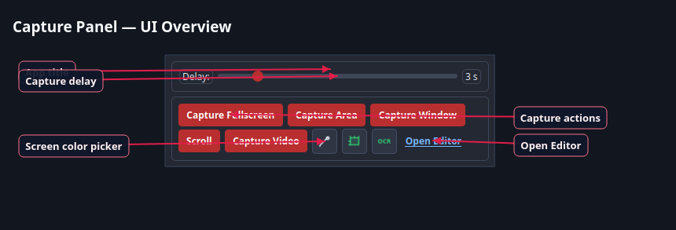
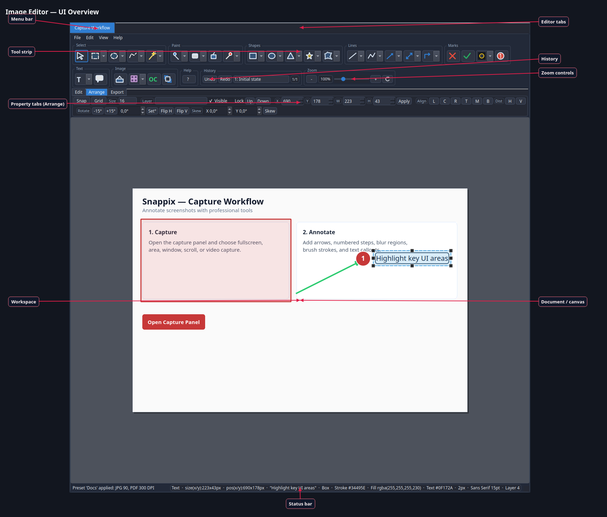
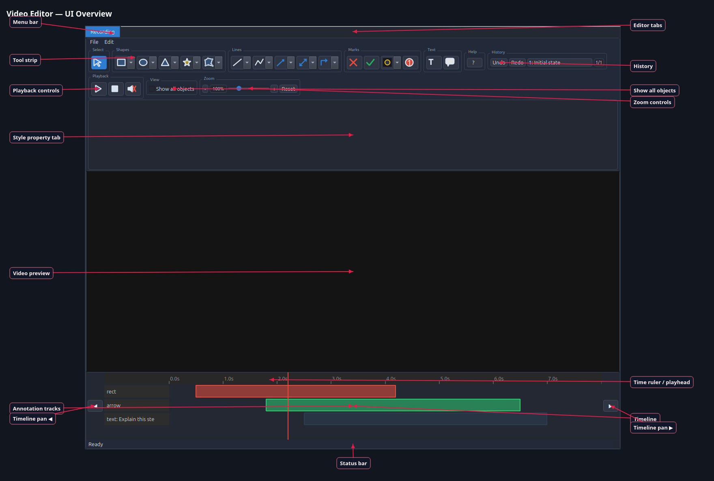

# Snappix UI Overview

English labeled screenshots of the Capture and Editor windows. Regenerate with:

```bash
.venv/bin/python scripts/generate_readme_screenshots.py
```

## Capture Panel



| Label | What it does |
| --- | --- |
| App title | Identifies the Capture window |
| Capture delay | Seconds to wait before capture starts (Esc cancels during countdown) |
| Capture actions | Fullscreen, Area, Window, Scroll, and Video capture |
| Screen color picker | Sample a screen color into the clipboard |
| MeasureBox | Draw a persistent measurement rectangle (`Ctrl+Shift+M` by default, editable in Settings → MeasureBox). Esc exits. Right-click the button for appearance shortcuts. |
| OCR | Select a region, recognize its text, and copy it to the clipboard (the screenshot itself is discarded) |
| Open Editor | Open the image editor without capturing |

Hover any control in the live app for a short English tooltip.

## Image Editor



| Label | What it does |
| --- | --- |
| Menu bar | File, Edit, View, and Help commands |
| Editor tabs | One tab per open image or video project |
| Tool strip | Drawing and selection tools grouped by category |
| History | Undo / redo and jump to earlier states |
| Zoom controls | Zoom the canvas view |
| Property tabs | Edit (colors plus the selection's thickness, line style, corner radius, and halo), Arrange, and Export panels |
| Workspace | Pasteboard around the document |
| Document / canvas | Editable screenshot and annotations |
| Selection footer | Whole-pixel size and position of the selection, and every vertex of a multi-point shape |
| Status bar | Feedback plus selection details |

Hover toolbar buttons and property controls for English tooltips.

## Video Editor



| Label | What it does |
| --- | --- |
| Menu bar | File, Edit, View, and Help commands (save project, export MP4, import, layer order, theme, settings) |
| Editor tabs | One tab per open image or video project |
| Tool strip | Drawing tools for time-based video annotations |
| History | Undo / redo and jump to earlier states |
| Playback controls | Play, stop/rewind, and mute the preview |
| Show all objects | Show every annotation even outside the playhead range |
| Zoom controls | Zoom the video preview |
| Edit property tab | Colors plus the selected annotation's thickness, line style, corner radius, and halo |
| Video preview | Plays the recording; place and edit overlays here |
| Time ruler / playhead | Scrub current time along the recording |
| Annotation tracks | Timed bars for each overlay (start/end on the timeline); right-click a bar to add Fade/Zoom/Slide entry or exit effects, summarized in brackets on the bar |
| Timeline | Full timeline row with tracks and playhead; click sets the playhead anywhere, double-click and hold then drag to stretch/compress the visible time range |
| Timeline pan ◀ / ▶ | Scroll the timeline one page left or right |
| Status bar | Feedback messages |

Hover toolbar and timeline controls for English tooltips.

## Export Panel

The Image Editor's third property tab collects everything that affects the exported
file rather than the document itself.

| Control | What it does |
| --- | --- |
| Preset | Quality preset for the export |
| Scale | Output resolution: @1x, @2x, or @3x |
| Keep transparency | When off, transparent pixels are filled with white (required for JPEG) |
| Presentation | Frames the export with padding, rounded corners, a drop shadow, and a backdrop |
| Presentation... | Opens the frame settings with a live preview of the actual export |
| Batch | Named batch profile, plus Manage and Batch Export |

The presentation frame runs last, on the finished image, so it applies to every export
format at once. Padding is a percentage of the longer edge, which keeps one setting
looking the same on a small crop and on a full-screen capture. Aspect presets letterbox
rather than crop — the frame only ever grows.

## Annotation Halo

`Halo` in the Edit tab draws a contrasting outline behind the selected annotation, so a
red arrow stays readable on a red banner. The annotation keeps its exact color; it only
gains an edge. The outline is white behind dark annotations and black behind light ones,
picked by WCAG contrast against the annotation itself — which means either the halo or
the annotation always separates from whatever is underneath.

The halo is **off by default**. With nothing selected, the
checkbox states what the next annotation will look like; with something selected, it shows
and changes that object.

Projects saved before this existed keep the look they were saved with — restoring a file
never adds a halo that was not in it.
